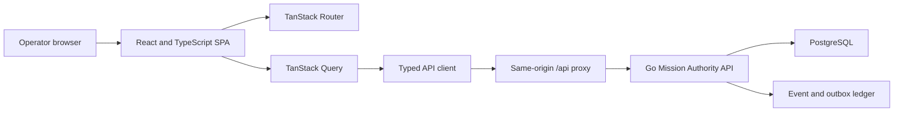

# Frontend Implementation Plan

| Field | Value |
| --- | --- |
| Status | Implemented |
| Plan date | 2026-07-18 |
| Target branch | `feat/frontend` |

## 1. Executive summary

Build a desktop-first, responsive operator console for the auth-scope Mission
Authority Service. The console should help authority administrators, approvers,
and auditors understand what an AI agent may do, inspect why a decision was
made, and intervene without editing raw JSON.

Use a React 19 and TypeScript single-page application built with Vite. The Go
service remains the only domain backend. During development, Vite proxies
`/api` to the Go service. In production, a small static web container serves the
compiled application and proxies `/api` to auth-scope, keeping browser requests
same-origin and avoiding a second domain layer.

The first release should concentrate on operational workflows:

1. Find and inspect missions, agents, pending authority expansions, and active
   containment rules.
2. Approve or deny mission proposals and expansion requests with clear evidence
   and consequence previews.
3. Revoke or complete missions, revoke agents and projections, and create or
   lift containment rules through explicit confirmation flows.
4. Trace mission and agent lineage and inspect the event ledger.
5. Configure approval rules and tool contracts.

Do not make the first release an agent runtime, an identity provider, or a
general policy-language IDE.

## 2. Framework decision

### Choice

- UI framework: React 19.2
- Language: TypeScript with strict compiler settings
- Build tool: Vite 8
- Package manager: pnpm with a committed lockfile
- Rendering: client-rendered SPA; no SSR

React is a good fit because the product has many reusable stateful controls,
tables, forms, detail panels, and graph views. Vite provides a typed React
template, fast development server, optimized static build, and straightforward
backend integration. The SPA does not need SEO or server-rendered content, and
avoiding a frontend application server keeps domain logic and authorization in
the Go service.

Pin exact package versions in `pnpm-lock.yaml` when Phase 0 begins. The version
targets above reflect the stable documentation available on the plan date;
upgrade only through reviewed dependency changes.

References:

- [React documentation](https://react.dev/)
- [Vite guide](https://vite.dev/guide/)
- [TanStack Router](https://tanstack.com/router/latest/docs/overview)
- [TanStack Query](https://tanstack.com/query/latest/docs/framework/react/overview)

### Supporting libraries

| Concern | Choice | Reason |
| --- | --- | --- |
| Routing | TanStack Router | Typed paths, validated search parameters, nested layouts, and route-level error boundaries |
| Server state | TanStack Query | Request caching, cancellation, retries, mutation state, and focused invalidation |
| Tables | TanStack Table | Headless sorting, filtering, pagination, and column visibility for dense operational data |
| Forms | React Hook Form and Zod | Performant forms with reusable runtime schemas and field-level errors |
| Lineage graphs | React Flow (`@xyflow/react`) | Proven interactive graph canvas with keyboard-accessible controls |
| UI primitives | Radix Primitives where native HTML is insufficient | Accessible dialogs, menus, tabs, popovers, and tooltips without imposing a visual theme |
| Icons | Lucide React | Consistent familiar action icons |
| Dates | date-fns | Small, explicit date formatting and duration helpers |
| Unit tests | Vitest and React Testing Library | Fast component and domain-helper tests in the Vite toolchain |
| API mocks | Mock Service Worker | One set of HTTP-level mocks for tests and local scenarios |
| End-to-end tests | Playwright | Cross-browser workflow and accessibility verification |

Do not add Redux initially. TanStack Query owns remote state, router search
parameters own shareable view state, React Hook Form owns form state, and small
React contexts own session and display preferences. Reconsider a global client
store only after a concrete cross-feature state problem appears.

## 3. Product boundaries

### Primary users

- Authority administrator: manages mission lifecycle, containment, agents,
  approval rules, tool contracts, and projections.
- Approver: reviews proposals or expansion requests and records a decision.
- Auditor or incident responder: traces lineage, blast radius, and event history
  without changing state.
- Integration developer: verifies decision artifacts, projections, and tool
  authorization behavior in a controlled workbench.

The backend currently treats configured administrators uniformly. The UI should
still separate these personas in its information architecture so future
capability claims can hide or disable actions without redesigning every page.

### Release-one goals

- Make current authority and lifecycle state easy to scan and compare.
- Put high-risk and pending work ahead of aggregate metrics.
- Explain every destructive or approving action before submission.
- Preserve deep links, filters, and selected tabs in the URL.
- Represent states and decisions with text and icons as well as color.
- Support keyboard navigation and WCAG 2.2 AA contrast and focus behavior.
- Keep domain types and API calls outside presentation components.

### Non-goals

- Running autonomous agents or storing their private signing keys in the UI.
- Replacing the AuthZEN or mission evaluation endpoints with browser logic.
- A drag-and-drop policy language or arbitrary condition expression builder.
- Tenant billing, user administration, or identity-provider administration.
- Editing immutable events, decision evidence, or historical mission versions.
- A public landing page.

## 4. Information architecture

Use a compact application shell with a persistent desktop sidebar, top-level
tenant and connection context, breadcrumbs, and one primary command area per
screen. Mobile and narrow layouts collapse navigation into a drawer and keep
read/review actions usable; complex lineage editing is not required because
graphs are read-only.

| Route | Screen | Primary purpose |
| --- | --- | --- |
| `/` | Operations overview | Pending approvals, active containment, recent high-risk decisions, service health |
| `/missions` | Mission inventory | Filter and compare missions by tenant, state, agent, principal, and expiry |
| `/missions/$missionRef` | Mission detail | Purpose, authority, conditions, lifecycle, delegation, projections, lineage, and events |
| `/approvals` | Approval queue | Pending proposals and expansion requests ordered by risk and age |
| `/approvals/proposals/$proposalId` | Proposal review | Review requested authority and approve with evidence |
| `/approvals/expansions/$expansionId` | Expansion review | Compare current/requested authority, approvals, containment, and decision impact |
| `/agents` | Agent inventory | Search identities, status, tenant, provider, and last related event |
| `/agents/$agentId` | Agent detail | Identity binding, missions, lineage, revocation, and related events |
| `/containment` | Containment workspace | Active/lifted rules, target scope, expiry, and blast-radius counts |
| `/containment/$ruleId` | Containment detail | Full affected resources and guarded lift workflow |
| `/governance/approval-rules` | Approval rules | List and create multi-approver rules |
| `/governance/tool-contracts` | Tool contracts | List, inspect, and register tool authorization contracts |
| `/projections` | Projection inventory | Inspect validity and revoke active projections |
| `/audit` | Event ledger | Filtered event history with correlation and causation navigation |
| `/audit/lineage/mission/$missionRef` | Mission lineage | Interactive mission, agent, projection, lease, and approval graph |
| `/audit/lineage/agent/$agentId` | Agent lineage | Cross-mission accountability graph for one registered agent |
| `/workbench` | Verification workbench | Verify decision artifacts and projections without retaining secrets |
| `/connection` | Connection and session | API health, authenticated principal, environment, and sign-out |

### Overview layout

The first viewport should be an operational dashboard, not a hero. Use compact
summary bands and work queues:

- Pending proposal and expansion approval counts.
- Active containment rules and nearest expiry.
- Suspended, expiring, or recently revoked missions.
- Recent deny, suspend, require-approval, and containment events.
- API and event-feed connection state.

Metrics must come from API aggregates or collection metadata. Do not derive
authoritative totals from a partial page of records.

### Detail-screen pattern

Use a consistent unframed detail layout:

- Header: human-readable objective, state, mission reference, version, tenant,
  and tightly scoped actions.
- Overview tab: purpose, principal, agent, lifecycle, and risk.
- Authority tab: resource grants, forbidden actions, constraints, and conditions.
- Delegation tab: parent, children, depth, attenuation, and cascade behavior.
- Integrations tab: projections, leases, and tool-related decisions.
- Lineage tab: lazy-loaded graph.
- Events tab: entity-filtered audit history.

## 5. Critical workflows

### Establish an administrator session

The current backend accepts configured bearer tokens but does not provide a
login or token exchange endpoint.

For local development only:

1. Show a connection screen that accepts the API base URL and administrator
   token.
2. Keep the token in memory only. Never write it to local storage, session
   storage, IndexedDB, URLs, logs, analytics, or error reports.
3. Validate it through `GET /v1/admin/session` before showing protected routes.
4. Clear it on reload, explicit sign-out, inactivity timeout, or any terminal
   authentication error.

Before production release, replace manual token entry with OIDC Authorization
Code with PKCE and make the Go service validate issuer, audience, expiry, and
capability claims. This is a release gate, not optional polish.

### Review an expansion request

1. Open a request from the approval queue.
2. Load the request, current mission version, active containment, matching
   approval rule, and existing approval records.
3. Render current and requested authority side by side. Highlight added
   resources, actions, constraints, and forbidden-action conflicts.
4. Show requester identity, justification, risk, reversibility, request age, and
   mission-version drift.
5. Require evidence method and a reason when denying.
6. Preview whether the action records one approval or completes the request.
7. Submit once; disable duplicate submission while pending.
8. On `409`, refresh all inputs and explain that authority changed before the
   decision committed.
9. On success, update the request, mission, queue count, and event views through
   targeted cache invalidation.

### Create containment

1. Choose a tenant and target type.
2. Select or enter a target with server-backed validation.
3. Add reason, optional expiry, and structured metadata.
4. Request a preflight blast-radius preview before submission.
5. Confirm the affected mission, agent, projection, lease, expansion, and tool
   counts.
6. Create the rule and navigate to its detail screen.

The current API computes blast radius only after a rule exists. Add a dry-run
endpoint before exposing the preview step, or label the initial release as
post-create inspection and require confirmation based on target scope alone.

### Lift containment or revoke authority

All destructive actions use a focused dialog with:

- Exact target and current state.
- Plain-language consequence summary.
- Required reason.
- Additional typed confirmation for tenant-wide containment lifts or broad
  revocations.
- Server result and request/correlation identifier.

Never use optimistic UI for authority expansion, approval, revocation,
completion, or containment mutations. Keep the old state visible until the
server confirms the transition.

## 6. Frontend architecture



### Proposed directory structure

```text
frontend/
  README.md
  IMPLEMENTATION_PLAN.md
  package.json
  pnpm-lock.yaml
  tsconfig.json
  vite.config.ts
  vitest.config.ts
  playwright.config.ts
  eslint.config.js
  index.html
  Dockerfile
  nginx.conf
  public/
  e2e/
    fixtures/
    approval-flow.spec.ts
    containment-flow.spec.ts
    mission-lifecycle.spec.ts
  src/
    app/
      App.tsx
      providers.tsx
      router.tsx
      styles/
    routes/
      __root.tsx
      index.tsx
      missions/
      approvals/
      agents/
      containment/
      governance/
      projections/
      audit/
      workbench/
      connection/
    features/
      missions/
        api.ts
        keys.ts
        schemas.ts
        components/
      approvals/
      agents/
      containment/
      governance/
      projections/
      audit/
      workbench/
    shared/
      api/
        client.ts
        errors.ts
        generated.ts
      auth/
      components/
      formatting/
      hooks/
      styles/
      testing/
```

Each feature owns its API adapters, query keys, schemas, domain presentation,
and tests. A feature may import from `shared`, but features should not reach into
one another's internals. Cross-feature navigation uses route links; shared
domain summaries move into an explicit public export only after real reuse.

### API client

- Publish an OpenAPI 3.1 document from the Go service as the source of truth.
- Generate TypeScript transport types with `openapi-typescript`.
- Keep a small hand-written `fetch` wrapper for base URL, bearer injection,
  JSON decoding, `AbortSignal`, request IDs, and normalized errors.
- Validate security-sensitive or loosely typed responses at runtime with Zod,
  especially `map[string]any` fields and graph metadata.
- Model errors as `{ code, message, requestId, fieldErrors, status }` in the UI.
- Accept an idempotency key for mutations once the backend supports it.
- Retry safe GET requests only. Never automatically retry authority mutations.
- Send `Accept: application/json` and a frontend-generated `x-request-id` on
  every request; surface the returned identifier in error details.

### Query and cache policy

- Scope every query key by API environment and tenant before entity identifiers.
- Use URL search parameters for table filters, sort order, cursor, and selected
  detail tab.
- Use 15-30 second freshness for queues and inventories; keep immutable event
  pages indefinitely once loaded.
- Cancel obsolete requests on route or filter changes.
- Invalidate only affected entity, collection, aggregate, and event keys after a
  mutation.
- Pause background refresh while the tab is hidden and refresh on focus for
  pending and active records.

### Event feed

Native `EventSource` cannot attach the required bearer header. Consume the SSE
response with authenticated `fetch` and a small standards-compliant event
parser, or use authenticated polling until the backend stream is truly live.

The current endpoint emits a finite snapshot and closes. Before presenting it
as live activity, add cursor or `Last-Event-ID` resume support, heartbeat events,
tenant filtering, disconnect cancellation, and a bounded reconnect policy. UI
connection state must distinguish live, reconnecting, polling, and offline.

## 7. Backend prerequisites

The current API supports entity reads for several resources but does not expose
the collection APIs needed for inventory screens. Complete these contracts in
parallel with the frontend foundation.

| Priority | Backend change | Frontend dependency |
| --- | --- | --- |
| P0 | Publish and CI-validate an OpenAPI 3.1 contract | Generated transport types and MSW fixtures |
| P0 | `GET /v1/admin/session` returning verified principal, tenant scope, capabilities, issuer, and API version | Protected routing and connection screen |
| P0 | Paginated/filterable `GET /v1/missions` | Overview and mission inventory |
| P0 | Paginated/filterable `GET /v1/mission-proposals` | Proposal approval queue |
| P0 | Paginated/filterable `GET /v1/expansion-requests` including approval progress | Expansion approval queue |
| P0 | Paginated/filterable `GET /v1/agents` | Agent inventory and target selection |
| P0 | Paginated `GET /v1/tool-contracts` and `GET /v1/projections` | Governance and projection inventories |
| P0 | Add cursor, limit, tenant, type, mission, actor, correlation, and time filters to `GET /v1/events` | Audit ledger and entity event tabs |
| P0 | Return `x-request-id` on responses and a stable error envelope with machine-readable code | Supportable error handling |
| P0 | Enforce tenant scope server-side on every admin collection and entity read | Prevent cross-tenant data exposure |
| P1 | Live resumable SSE with bounded history and heartbeats | Live operations feed |
| P1 | Containment dry-run or blast-radius preview endpoint | Pre-create consequence preview |
| P1 | Aggregate counts endpoint grouped by state and tenant | Accurate overview metrics |
| P1 | Idempotency keys for high-impact mutations | Safe recovery from interrupted submissions |

Use a consistent collection envelope:

```json
{
  "items": [],
  "next_cursor": "opaque-or-empty",
  "total": 0
}
```

Use opaque cursors with a stable server-side sort such as `(created_at, id)`.
Cap page size and return the effective limit. UI filters are conveniences, not
authorization controls.

## 8. Visual and interaction system

The product is a security and operations tool. It should feel quiet, precise,
and dense without becoming cramped.

- Use a neutral canvas, white work surfaces, dark readable text, and distinct
  semantic colors for active/allow, pending/warning, deny/revoked, and selected
  states. Do not make one hue carry the entire interface.
- Use an 8px spacing grid and border radii no greater than 8px.
- Use tables for comparable records and definition lists for entity details.
- Reserve cards for repeated work items and compact metrics, not entire page
  sections or nested containers.
- Use Lucide icons for familiar actions and tooltips for unfamiliar icon-only
  controls.
- Keep destructive commands in menus or explicit action groups, not beside
  everyday navigation.
- Render resource grants and constraints as structured rows, not raw JSON by
  default. Offer a read-only JSON view as a secondary tab.
- Use skeletons only where dimensions are stable; use explicit empty, error,
  unauthorized, offline, and stale states everywhere data can be absent.
- Never rely on color alone for mission state, decision, risk, or connection
  status.

### Accessibility requirements

- Meet WCAG 2.2 AA for contrast, keyboard access, focus order, labels, dialogs,
  error association, and motion preferences.
- Keep a visible skip link and main landmark.
- Announce mutation success and failure through an ARIA live region without
  moving focus unexpectedly.
- Return focus to the invoking control after dialogs close.
- Provide a table or ordered-list alternative for lineage graph content.
- Test at 200% browser zoom and viewport widths of 360, 768, 1280, and 1600px.

## 9. Delivery phases

Estimates assume one engineer familiar with React and access to backend support.
They are sizing guidance, not calendar commitments.

### Phase 0: Contract and repository foundation (3-5 days)

- Confirm the P0 API shapes and add the OpenAPI contract.
- Scaffold React, TypeScript, Vite, pnpm, linting, formatting, unit tests, and
  Playwright in `frontend/`.
- Add CI commands for install, typecheck, lint, test, build, and E2E.
- Add the typed API client, normalized errors, MSW setup, and generated fixture
  factories.
- Add the frontend Dockerfile, static server configuration, Vite development
  proxy, and Compose service.

Exit criteria:

- `pnpm lint`, `pnpm typecheck`, `pnpm test`, and `pnpm build` pass.
- `docker compose up` starts database, API, and frontend with working health
  checks and a relative same-origin `/api` request.
- Generated types are reproducible and CI fails when the checked-in contract and
  generated types differ.

### Phase 1: Shell, session, and design foundation (3-4 days)

- Implement the application shell, responsive navigation, route boundaries,
  tenant context, connection screen, in-memory development session, and sign-out.
- Build reusable button, icon button, input, select, tabs, status badge, table,
  empty state, error state, dialog, toast, and confirmation primitives.
- Add health and session checks and protected-route behavior.
- Document semantic tokens and component conventions in source examples.

Exit criteria:

- Unauthenticated users cannot reach protected routes.
- Tokens never appear in persisted browser storage, URLs, console output, or
  captured error payloads.
- Keyboard navigation and automated axe checks pass for shell and primitives.

### Phase 2: Missions and proposals (5-7 days)

- Build operations overview, mission inventory, mission detail tabs, and proposal
  approval queue/review.
- Add filters, cursor pagination, column settings, deep links, copy controls, and
  expiry formatting.
- Implement mission revoke and complete confirmations.
- Add structured authority, condition, lifecycle, and delegation components.

Exit criteria:

- An administrator can find a mission, understand its effective authority and
  lifecycle, approve a proposal, and revoke or complete a mission.
- `409`, stale version, not found, and unauthorized cases have tested recovery
  paths.

### Phase 3: Expansion approvals and containment (5-7 days)

- Build expansion queue, authority diff, approval progress, approve/deny flows,
  approval rule list/create, containment inventory/detail/create/lift, and blast
  radius views.
- Keep destructive mutations pessimistic and refresh all related records after
  completion.
- Add confirmation strength based on target breadth and affected-resource count.

Exit criteria:

- Two distinct configured approvers can complete a multi-approval flow without
  the UI confusing their identities.
- Containment blocks an otherwise valid expansion and the UI explains the block.
- Concurrent decision conflicts refresh to the committed server state.

### Phase 4: Agents, tools, projections, and workbench (4-6 days)

- Build agent inventory/detail and revoke flow.
- Build tool contract inventory/create/detail.
- Build projection inventory/status/revoke and artifact/projection verification
  workbench.
- Redact tokens and signed artifacts by default; reveal only through deliberate
  temporary controls and never place them in telemetry.

Exit criteria:

- Operators can trace each integration object back to mission and agent context.
- Sensitive values are hidden in screenshots, logs, and default rendered state.

### Phase 5: Audit and lineage (5-7 days)

- Build filtered event ledger, event detail, correlation/causation navigation,
  mission lineage, agent lineage, graph controls, and accessible graph fallback.
- Integrate live SSE only after resume and heartbeat semantics are available;
  otherwise ship explicit polling.
- Lazy-load graph code and large event details.

Exit criteria:

- An auditor can start from a mission, agent, expansion, or event and follow the
  relevant authority chain without copying identifiers between screens.
- Reconnect does not duplicate or silently skip events in automated tests.

### Phase 6: Hardening and release (4-6 days)

- Replace development token entry with the selected production OIDC flow.
- Perform threat modeling, dependency scanning, CSP review, accessibility audit,
  browser matrix testing, and recovery testing.
- Add observability, runbooks, build metadata, immutable image tags, and release
  documentation.
- Complete load tests for large tables, event histories, and lineage graphs.

Exit criteria:

- All release gates in Section 12 pass in CI and a production-like Compose or
  staging environment.
- No manual bearer-token flow is enabled in the production build.

## 10. Testing strategy

### Unit tests

Test pure behavior rather than implementation details:

- Authority diffing and constraint rendering.
- State, risk, and decision presentation mappings.
- Date, expiry, and duration formatting.
- Query-key construction and error normalization.
- Zod schemas and form transformations.
- SSE event parsing and deduplication.

### Component and integration tests

Use Testing Library with MSW:

- Loading, empty, populated, stale, error, forbidden, and offline states.
- URL-backed filters and pagination.
- Accessible forms and field/server validation.
- Mutation pending, success, conflict, and retry decisions.
- Confirmation dialogs and focus restoration.
- Token redaction and session clearing.

### End-to-end tests

Run Playwright against the complete Docker Compose stack with deterministic seed
data. Cover at minimum:

1. Connect as Alice and approve a mission proposal.
2. Review an expansion that requires Alice and Bob, change sessions, and complete
   the second approval.
3. Create containment, inspect blast radius, observe a blocked expansion, and
   lift containment.
4. Revoke a mission and verify its child mission and projection consequences.
5. Navigate mission and agent lineage from an event.
6. Recover from a simulated `409` and an expired administrator session.
7. Verify keyboard-only completion of the approval and containment workflows.

Use Playwright screenshots at desktop and mobile widths for layout regressions,
but assert semantics and outcomes rather than relying only on pixel snapshots.

### Coverage and quality thresholds

- At least 80% statement and branch coverage for frontend-owned TypeScript,
  excluding generated API types and trivial entry files.
- 100% coverage for authority diffing, token redaction, and normalized error
  behavior.
- Zero serious or critical automated accessibility violations on core routes.
- No TypeScript errors, lint errors, unhandled console errors, or failed network
  requests in the happy-path E2E suite.

References:

- [Playwright documentation](https://playwright.dev/docs/intro)
- [Mock Service Worker documentation](https://mswjs.io/docs/)
- [React Flow documentation](https://reactflow.dev/learn)

## 11. Delivery and operations

### Docker Compose

Add a `frontend` service that:

- Builds `frontend/Dockerfile` through a pinned Node build stage.
- Serves immutable hashed assets with long cache lifetimes.
- Serves `index.html` with `no-cache` and SPA fallback routing.
- Proxies `/api/*` to `http://auth-scope:8080/*` with streaming disabled only
  where necessary and buffering disabled for SSE.
- Exposes `${AUTH_SCOPE_FRONTEND_PORT:-3000}:8080`.
- Has a lightweight `/healthz` endpoint and depends on the API health check.

Keep API URLs relative in browser code. Do not bake environment-specific backend
hosts or credentials into the JavaScript bundle.

### CI pipeline

Run these jobs on frontend or API-contract changes:

1. Dependency install with frozen lockfile and cache keyed by lockfile hash.
2. Generated-type drift check.
3. Typecheck and lint.
4. Unit and component tests with coverage.
5. Production build and bundle-size budget.
6. Container build and vulnerability scan.
7. Playwright smoke tests against Docker Compose.
8. Full Chromium, Firefox, and WebKit E2E suite before release.

### Observability

- Attach frontend build SHA, route template, API request ID, and environment to
  errors.
- Redact authorization headers, tokens, signed artifacts, actor context, and
  arbitrary metadata before telemetry leaves the browser.
- Track API latency and failure by endpoint template, not raw URL identifiers.
- Track workflow outcomes such as approval conflict or containment block without
  recording mission purpose or authority details.
- Expose a user-copyable diagnostic bundle containing safe build, browser,
  route, and request IDs.

## 12. Release gates

The first production release is complete only when:

- Production authentication uses OIDC or an equivalent short-lived,
  capability-bearing mechanism; manual shared-token entry is disabled.
- Every collection and entity endpoint enforces tenant scope on the server.
- OpenAPI and generated frontend types are synchronized in CI.
- All destructive and approval workflows have server-backed confirmation,
  conflict handling, audit events, and E2E coverage.
- `docker compose up` starts the full stack from a clean checkout.
- Frontend statement and branch coverage are at least 80%.
- Core workflows pass Chromium, Firefox, and WebKit E2E tests.
- Core routes pass keyboard, 200% zoom, responsive layout, and WCAG 2.2 AA
  checks.
- CSP, cache headers, secret redaction, dependency scan, and container scan are
  documented and passing.
- Initial JavaScript is below 300 KB gzip; lineage and workbench code is
  route-lazy-loaded.
- No page uses an unbounded collection response or performs client-side tenant
  authorization.

## 13. Recommended issue sequence

Create implementation issues in this order so useful vertical slices land
without building screens against invented contracts:

1. Define frontend OpenAPI subset and collection/error conventions.
2. Add admin session and paginated mission/proposal/expansion endpoints.
3. Scaffold frontend, CI, Docker image, and Compose proxy.
4. Build API client, session boundary, shell, and UI primitives.
5. Ship mission inventory/detail as the first read-only vertical slice.
6. Ship proposal approval as the first mutation vertical slice.
7. Add expansion approvals and multi-approver session switching for development.
8. Add containment and blast-radius workflows.
9. Add agents, tool contracts, projections, and verification workbench.
10. Add filtered event ledger and lineage graph.
11. Add production identity integration and complete security hardening.
12. Run release-gate audit and publish the first full-stack image set.

The first demonstrable milestone should be issues 1-5: a containerized console
that authenticates, lists missions, opens a mission detail view, and runs with
the existing Go service through one `docker compose up` command.
